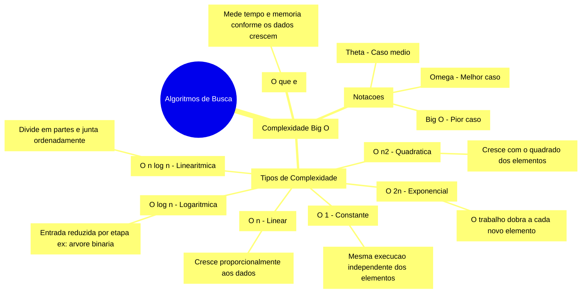

# Algoritmos de Busca e Complexidade

```mermaid
mindmap
  root((Algoritmos de Busca))
    [Complexidade Big O]
      [O que e]
        [Mede tempo e memoria conforme os dados crescem]
      [Notacoes]
        [Omega - Melhor caso]
        [Theta - Caso medio]
        [Big O - Pior caso]
      [Tipos de Complexidade]
        [O 1 - Constante]
          [Mesma execucao independente dos elementos]
        [O n - Linear]
          [Cresce proporcionalmente aos dados]
        [O log n - Logaritmica]
          [Entrada reduzida por etapa ex: arvore binaria]
        [O n2 - Quadratica]
          [Cresce com o quadrado dos elementos]
        [O n log n - Linearitmica]
          [Divide em partes e junta ordenadamente]
        [O 2n - Exponencial]
          [O trabalho dobra a cada novo elemento]
```
